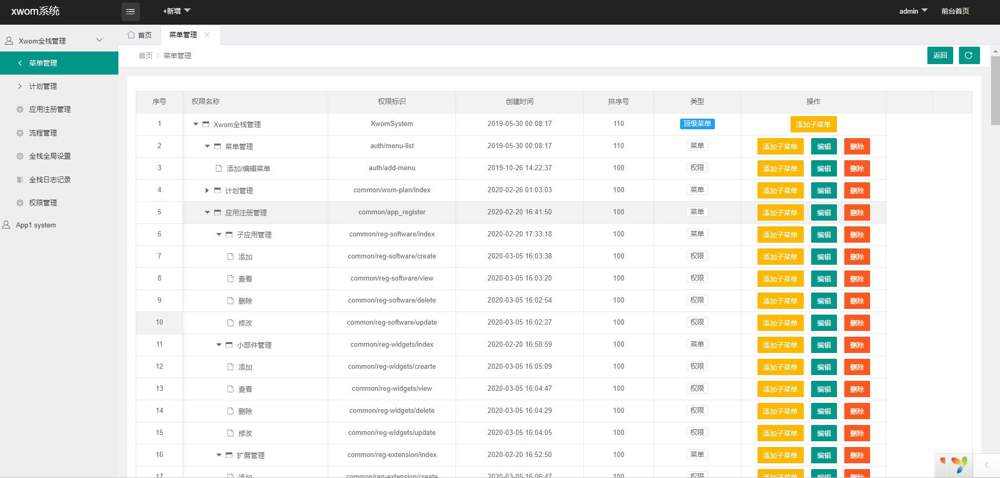
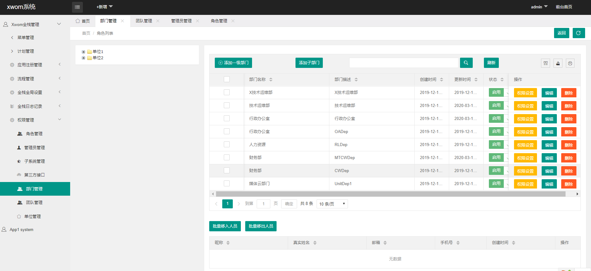
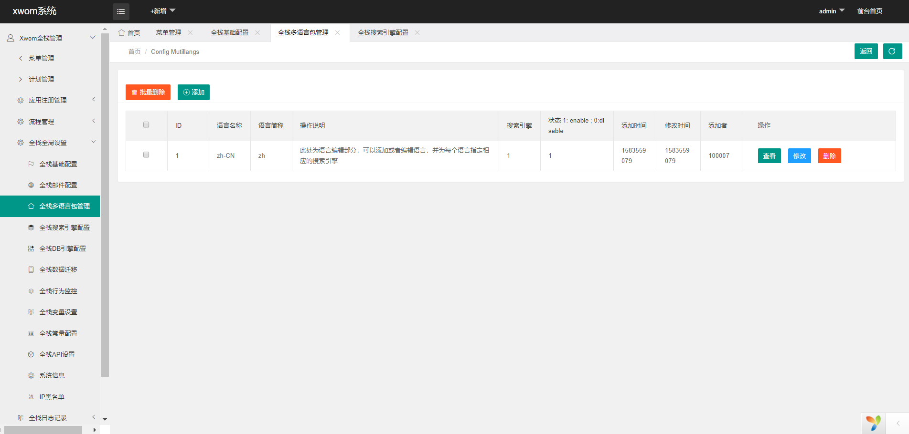

## YII2 Xwom System
------------
xwom是基于Yii2的综合管理业务快速开发引擎。

本引擎采用YII V2.032搭建，其运行环境与yii2(php>=5.4)一致。

xwom旨在为yii2爱好者提供一个基础功能稳定完善的系统，使开发者更专注于业务功能开发。xwom没有对yii2做任何的修改、封装，但是把yii2的一些优秀特性几乎都用在了xwom上， 但xwom提倡简洁、快速上手，基于xwom开发可以无需文档，可以在此基础开发其实际应用，譬如：cms内容管理系统、商城、ERP、新闻采编等。

一、更新记录Records
------------

1.0.0beta1 开启xwom开发引擎beta1，预装常用扩展组件，对配置文件做细致的注释说明。

二、帮助Help
------------
（1）QQ群： 170794993  欢迎xwom爱好者，加入开源开发小组。

（2）Email： chareler@163.com

三、功能
------------
 * 多语言
 * 菜单管理
 * GII 模板
 * RBAC实现管理员、角色、部门、团队、单位、应用 6个维度权限管理
 * 开启API应用
 * 计划管理
 * 流程管理WorkFlow（BPM）工作流驱动业务数据流转
 * 全栈全局设置管理
   包括：
   * 全栈基础配置
   * 全栈邮件配置
   * 全栈短信配置
   * 全栈多语言包管理
   * 全栈搜索引擎配置
   * 全栈DB引擎配置
   * 全栈数据可视化迁移
   * 全栈变量配置
   * 全栈常量配置
   * 全栈API设置
   * 系统信息
   * IP黑名单
 * 全栈日志管理
   * 全局日志
   * 短信日志
   * 行为日志
 * 开启AP子应用开发
    

四、快速体验Experience
------------
……

五、安装 Installation
------------
1、composer install

2、依次执行以下命令初始化yii2框架以及导入数据库
```php
$ cd webApp
$ php ./init --env=Development #初始化yii2框架，线上环境请使用--env=Production
$ php ./yii migrate/up --interactive=0 #导入迁移备份数据库，执行此步骤之前请先到common/config/main-local.php修改成正确的数据库配置

```
3、配置web服务器

4、完成
附:web服务器配置
* Apache
 ```bash
<VirtualHost *>
    ########此处下面是xwom开发引擎开源地址#
    DocumentRoot path/to/xwom/backend/web/
	ServerName localhost
    #<Directory "path/to/xwom/backend/web/">
    ########此处下面是xwom开发引擎开源地址#
    <Directory "path/to/xwom/backend/web/">
    
            #SetOutputFilter DEFLATE
            #Options FollowSymLinks
            #Options Indexes FollowSymLinks Includes MultiViews ExecCGI
            Options Indexes FollowSymLinks MultiViews
            AllowOverride All
            Order allow,deny
            Allow from all
            DirectoryIndex index.html index.php

            # use mod_rewrite for pretty URL support
            RewriteEngine on
            # If a directory or a file exists, use the request directly
            RewriteCond %{REQUEST_FILENAME} !-f
            RewriteCond %{REQUEST_FILENAME} !-d
            # Otherwise forward the request to index.php
            RewriteRule . index.php
    </Directory>
</VirtualHost>
  ```
  
 * Nginx
 ```bash
    略
 ```
 
六## 配置Configuration

```php
common/main-local.php

    'components' => [
        'db' => [
            'class' => 'yii\db\Connection',
            'dsn' => 'mysql:host=localhost;dbname=xxx',
            'username' => 'xxx',
            'password' => '',
            'charset' => 'utf8',
        ],
        //……
    ],


```
```php
backend/main.php

    'modules' => [
        /** migration数据库库迁移模块业务 **/
        'migration' => [
            'class' => 'migration\Module',
        ],
        //……
        /**  workflow BPM2.0**/
        'workflow' => [
            'class' => 'jinostart\workflow\manager\Module',
            'layout' => '//main',
        ],
    ],

    'components' => [
     //……
        /** workflow BPM2.0    * **/
        'view' => [
            'theme' => [
                'pathMap' => [
                    '@app/views' => '@backend/themes/default/views',
                    '@app/widgets' => '@backend/themes/default/widgets',
                    '@vendor/jinostart/yii2-workflow-manager/src/views' => '@backend/themes/default/modules/workflow/views'
                ],
            ],
        ],
        'workflowSource' => [
            'class' => 'jinostart\workflow\manager\components\WorkflowDbSource',
        ],
        //……
    ],


```
七、运行效果
------------
……











## 八、特别鸣谢Links
------------
- [Yii2](http://www.yiiframework.com/)
- [Yii2 Extension](http://www.yiiframework.com/extension/yii2-workflow-manager)
- 开发组成员：WeihuaWang YanchengLiu CharlesLee


