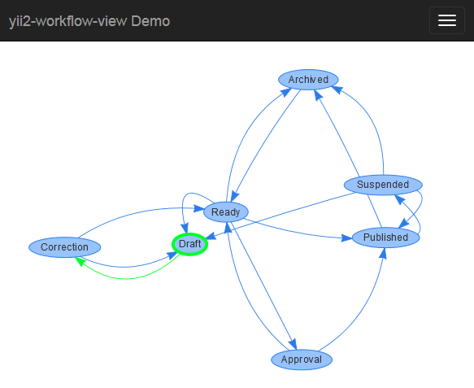

**PROOF OF CONCEPT - NOT ACTIVELY MAINTAINED**

# yii2-workflow-view

[](https://packagist.org/packages/raoul2000/yii2-workflow-view)
[](https://packagist.org/packages/raoul2000/yii2-workflow-view)
[](https://packagist.org/packages/raoul2000/yii2-workflow-view)

*A Widget to display workflows created with [yii2-workflow](https://github.com/raoul2000/yii2-workflow)*

Checkout the [demo](http://raoul2000.good-gamer.net/index.php?r=workflow/view)

## Installation

The preferred way to install this extension is through [composer](http://getcomposer.org/download/).

Either run

```
php composer.phar require --prefer-dist raoul2000/yii2-workflow-view "*"
```

or add

```
"raoul2000/yii2-workflow-view": "*"
```

to the require section of your `composer.json` file.

## Usage

To display a workflow with the widget, you must have ... a workflow to display ! Once you have
it, just assign it to the `workflow` parameter of the `WorkflowViewWidget`.

In the example below we are assuming that the `Post` model is attached to a `SimpleWorkflowBehavior` and that it has been correctly
initialized.

```php
<?php
$post = new app\models\Post();

raoul2000\workflow\view\WorkflowViewWidget::widget([
	'workflow'    => $post,
	'containerId' => 'myWorkflowView'
]);
?>

<div id="myWorkflowView" style="height: 400px;"></div>
```
In this example we have passed model instance to the widget but can also pass a Workflow instance to display it.
When a model is passed to the widget, it will display the workflow the model is in, and if the model is not in a workflow (i.e. it
has no status), the widget displays the *default workflow*.

Here is an example of workflow view produced by the widget :



As you can see, the **initial status** is highlighted with a green thick border.

For more information on the *SimpleWorkflowBehavior* and the wonderful world of workflows with Yii2,
please refer to [yii2-workflow](https://github.com/raoul2000/yii2-workflow)

Note that this widget relies on [vis.js](https://github.com/almende/vis) to render the workflow.

License
-------

**yii2-workflow-view** is released under the BSD 3-Clause License. See the bundled `LICENSE.md` for details.

[](http://www.yiiframework.com/)
